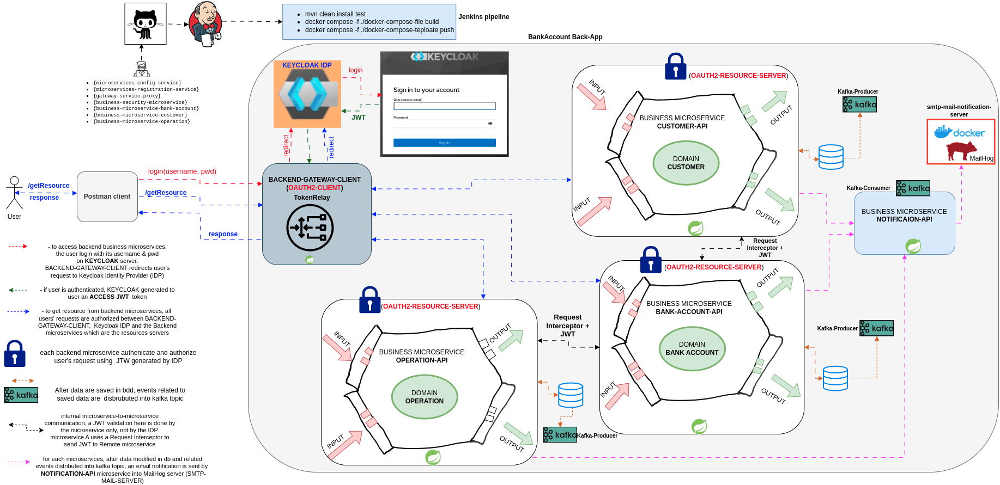
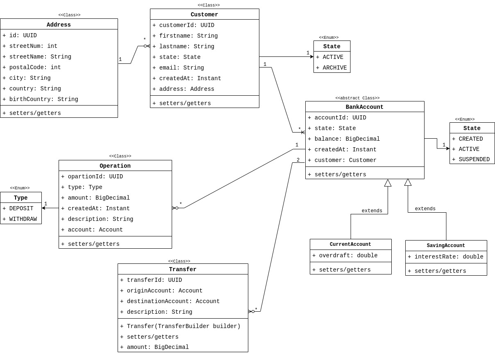
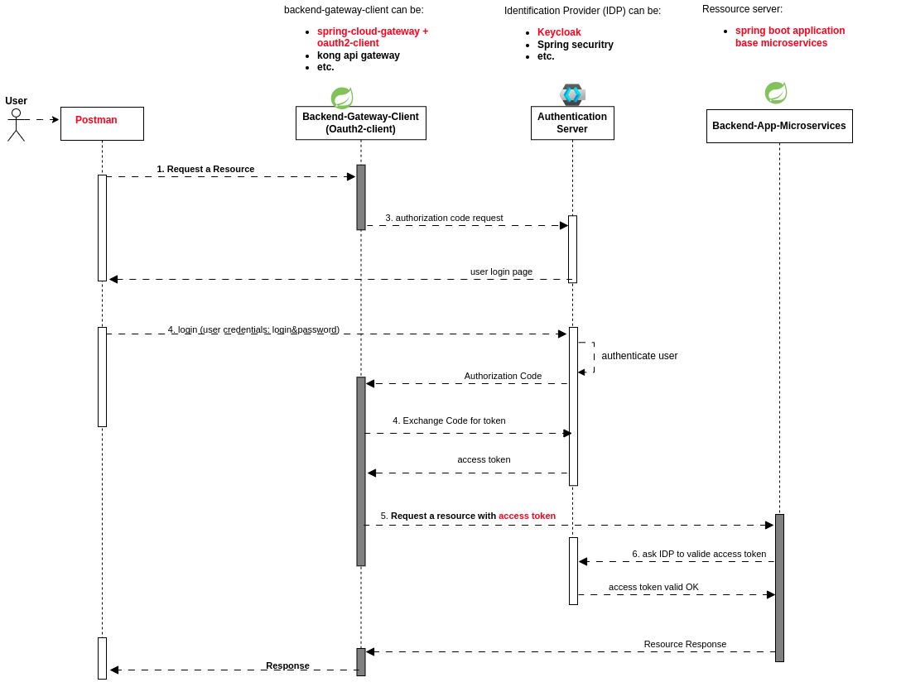
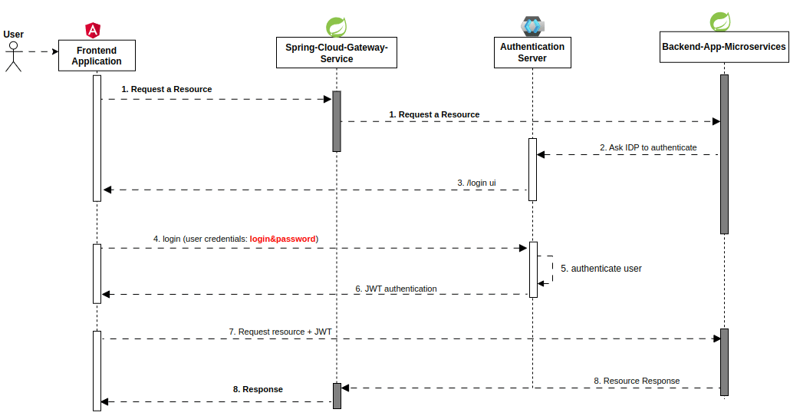

# Bank-Account-App [Micro services | Spring boot 3 | Spring cloud | Kafka |  KeyCloak]
- **Bank-Account-App** est application fullstack (Java 21 /Angular 16) orientée microservices composée des microservices **métiers** et des  microservices **transverses**.
    - la communication entre les microservices se fait de manière **synchrone** avec **Spring Web Client**
- Chaque microservice métier est implémenté dans une **architecture hexagonale**, des tests unitaires sont écrits pour garantir la qualité du code source.
    - **SonarQube** est utilisé pour checker les vulnérabilités, le code smell, la couverture de code et la sécurité
- Une **infrastructure Kafka** est mise en place:
    - pour persister et distribuer les événements liés à la modification des données dans la BDD.
- Un **KeyCloak Identity Provider (IDP)** est utilisé pour authifier et autoriser l'accès au resources server (Backend microservice)
    - utilisation d'un **JWT** géré par **KeyCloak**
- Une **application frontend** en Angular 16 pour servir de ui aux utilisateurs.
- mise en place d'un workflow avec Jenkins pour automatiser les jobs: ***build***, ***test***, ***docker build***, ***docker push***.

## Bank-Account-App architecture
L'architecture globale de l'application **Bank-Account-App**


## Bank-Account-App conceptual model
Modèle global conceptuel de l'application **Bank-Account-App**


## Authentication & authorization flows to backend resources
Before connecting the frontend application (Angular App), a **Backend-Gateway-OAuth2-Client** is configured as **trusted** in KeyCloak.  
Refering the flow below
- Backend-Gateway-Client serves as **TokenRelay** between **KeyCloak** IDP and **Backend resources servers**
-  and routes authenticated client requêtes (postman) to Backend resources servers. 


After implementing the frontend application (Angular App), refering the flow below: 
- all the configurations are moved on frontend side and removed on Backend-Gateway-Client side
- The Backend-Gateway-Client becomes a simple gateway to route any request without any check
- Frontend App is configured as trusted is KeyCloak


# Partie Backend
La partie backend de comprend:

 - **4 applications microservices métiers**:
    - ```exalt-hexagonal-archi-kafka-keycloak-bs-ms-customer```
        - managing customers, 
        - oauth2 authentication & authorization est implémenté pour authentifier toutes les requêtes vers ce backend
    - ```exalt-hexagonal-archi-kafka-keycloak-bs-ms-bank-account```
        - managingg bank-accounts
        - oauth2 authentication & authorization est implémenté pour authentifier toutes les requêtes vers ce backend
    - ```exalt-hexagonal-archi-kafka-keycloak-bs-ms-operation```,
        - managing operations on bank-accounts
        - oauth2 authentication & authorization est implémenté pour authentifier toutes les requêtes vers ce backend
    - ```exalt-hexagonal-archi-kafka-keycloak-bs-ms-notification-service```
        - envoie une notification par mail lorsqu'une operation d'écriture se produit sur un customer, un compte ou une operation 

- chaque microservice métier utilse sa propre base de données MySql pour la persistance les data

- **1 api microservice transverse**: 
    - ```exalt-hexagonal-archi-kafka-keycloak-backend-gateway-oauth2-client```  to oute users' requests to backend microservices
- **infrastructure kafka**: pour la persistance et la distribution des événements kafka
    - un zookeeper-server 
    - 2 kafka-servers
    - un schema-registry-service
        - pour definir le modèle commun de message pour le **producer** et le **consumer**
        - utilise **avro** pour définir ce modèle
    - un kafka-UI

- Tout l'ecosystème des applications de **Bank-Account-App** est containeurisé avec **docker** et déployés ensuite dans un cluster locale **Minikuke** avec **Kubernetes**
    - **docker engine** pour construire les images docker pour chaque service
    - **docker compose** pour prépaper le le déploiement de la stack des containers 
    - cluster local **Minikuke** ensuite dans le cluster GCP avec **GKE**: Google Kubernetes engine

# Partie Frontend

La partie frontend de **Bank-Account-App **** est une application développée en angular 16**:
- Pattern observable avec **RxJs**
- Gestion observable liés aux événements de click
- Design graphique avec **PrimeNG**
