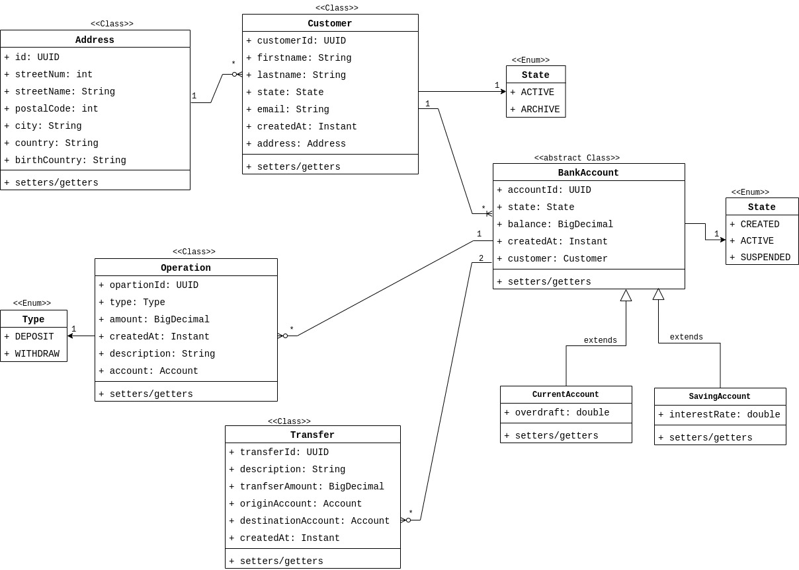
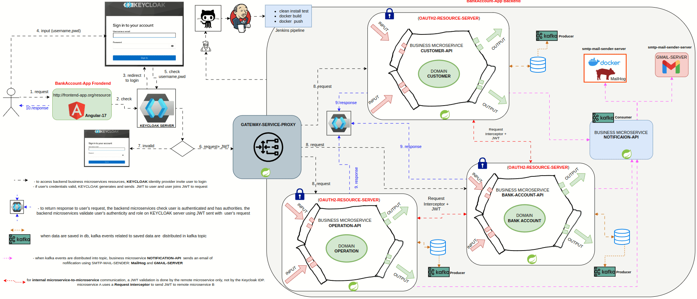

# Bank-Account-App [Archi hexagonale | Microservices | Spring boot 3 | Spring Security | Kafka |  KeyCloak | Angular]
- **Bank-Account-App** est application fullstack orientée microservices: 
    - des**business** microservices  et des **transverses** microservices.
    - la communication entre les business microservices est **synchrone** avec **OpenFeign** de Spring Cloud.
- Chaque business microservice implémente une **architecture hexagonale**.
- Des tests unitaires et d'intération pour garantir la qualité du code source.
    - **SonarQube** check les vulnérabilités, le code smell, la couverture de code et la sécurité
- Mise en place d'une **infrastructure Kafka**:
    - pour persister et distribuer les événements liés à la modification des données dans les BDD.
- **KeyCloak** Identity Provider pour authentifier et autoriser l'accès aux Backend resource servers
    - ici, les resource servers sont des business microservices
    - Les **users**, les **roles** et les **JWT** sont géré par **KeyCloak**
- Une **application frontend** en Angular 17.
- Un workflow avec Jenkins pour automatiser les jobs: 
    - builder chaque microservice ***mvn clean install***,
    - pour lancer les tests unitaires et d'intération ***mvn test***, 
    - builder l'image docker de chaque microservice ***docker compose -f stak.yml build***, 
    - publier les images into dockerhub ***docker compose -f stack.yml push***.

## Backend architecture of Bank-Account-App


## Bank-Account-App conceptual model
Modèle conceptuel de l'application **Bank-Account-App**


## Authentication & authorization flows to backend resources
Before connecting the frontend application (Angular App), a **Backend-Gateway-OAuth2-Client** is configured as **trusted client** in KeyCloak. Refering the flow below
- Backend-Gateway-OAuth2-Client serves as **TokenRelay** between **KeyCloak** IDP and **Backend resources servers**
- and routes authenticated user's requests (postman) to Backend resources servers. 


After connecting the **frontend-App** to the **Backend Microservices**, refering the flow below: 
- all configurations are moved on frontend side and removed on Backend-Gateway-OAuth2-Client side
- The Backend-Gateway-OAuth2-Client becomes a simple gateway to route any request without any check
    - it is no longer a TokenRelay
- Frontend App is configured as **trusted** in KeyCloak, refer to flow below:


## Bank-Account-App architecture Backend & Frontend connected


## Bank-Account-App architecture summary


# Backend
## 4 applications microservices business:
 chaque business microservice implémente une architecture hexagonale
- ```exalt-hexagonal-archi-kafka-keycloak-bs-ms-customer-api```
    - managing customers, 
    - oauth2 authentication & authorization are implemented to filter all requests towards this api
- ```exalt-hexagonal-archi-kafka-keycloak-bs-ms-bank-account-api```
    - managingg bank-accounts
    - oauth2 authentication & authorization are implemented to filter all requests towards this api
- ```exalt-hexagonal-archi-kafka-keycloak-bs-ms-operation-api```,
    - managing operations on bank-accounts
    - oauth2 authentication & authorization are implemented to filter all requests towards this api
- ```exalt-hexagonal-archi-kafka-keycloak-bs-ms-notification-api```  
    when a business microservice: customer-api, bank-account-api or operation-api produce an event into kafka topic:  
    - ```exalt-hexagonal-archi-kafka-keycloak-bs-ms-notification-api``` send an email notification on **smtp-mail-notification-server**: MailHog docker container
    - this api has no exposed endpoint

Bank-Account-App being a microservices based, each business microservice uses its own **MySql** db to persist is data.

## 1 api microservice transverse 
- ```exalt-hexagonal-archi-kafka-keycloak-backend-gateway-oauth2-client``` working as **TokenRelay**
    - this token relay is used before fronted is connected to backend
- ```exalt-hexagonal-archi-kafka-keycloak-backend-gateway-service-proxy```:
    - after frontend is connected to backend, we use this simple gateway-service-proxy just to route users' requests without security check

## infrastructure kafka
infrastructure kafka for persisting and distributing kafka events
- a zookeeper-server 
- 2 kafka-servers
- a schema-registry-service
    - to register a common model schema for **producer** and **consumer**
    - we use **avro** to define the model schema
- a kafka-ui for graphic user interface to follow flows into kafka infrastructure

## docker deployment
all **Bank-Account-App** services: business microservices, transverse microservices, infrastructure service are deployed in docker containers using: **docker engine** and **docker compose**:
- **docker engine** to build business microservices and transverse microservices into docker images
- **docker compose** to prepare deployment of the stack of docker images into docker containers

## exposed apis by business microservices


## Cloud deployment
- all docker containers of the stack **bank-account-app-compose.yml** are deployed in **kubernetes** cluster (minikube cluster) and then in GCP cluster using **GKE**: Google Kubernetes Engine

# Partie Frontend
The frontend part of **Bank-Account-App** is an angular (v17) application
- pattern observable with **RxJs**
- managing Observable related to user events like click on button
- graphic design with **PrimeNG**
- integrate **Keycloak** as identity provider